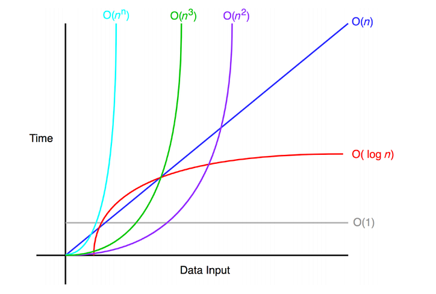
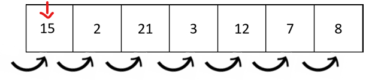
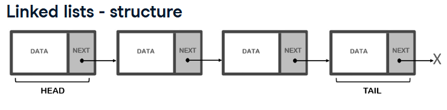
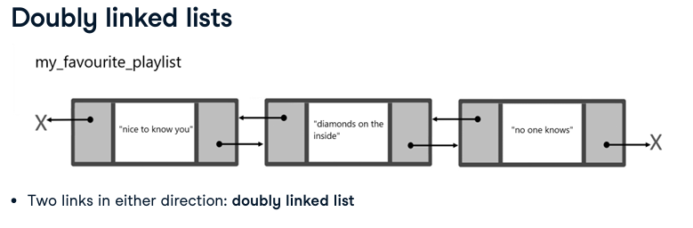

# Estructuras de Datos y Algoritmos (Data Structures and Algorithms)

## Algoritmos (Algorithms)
Es un conjunto de intrucciones para realizar una tarea específica.

## Estructuras de Datos (Data Structures)
Son herramientas que nos permiten organizar, almacenar y manipular datos de manera eficiente mientras ejecutamos un algoritmo.

> 💡 **Analogía:** Piensa en las *estructuras de datos* como los bloques de Lego con diferentes formas y tamaños, y en el *algoritmo* como el manual de instrucciones que te dice exactamente cómo unir esos bloques para construir un castillo.

---

## Notación Big O / Complejidad Temporal (Big O Notation)

Imagina que trabajas en el backend de una tienda online: por la mañana tienes 500 usuarios activos, pero al iniciar el *Black Friday*, de un momento a otro aparecen más de 100,000 usuarios en simultáneo. Cada usuario realiza operaciones al mismo tiempo: busca productos, filtra por precio, agrega al carrito y confirma stock.

**La pregunta clave es:** ¿Cómo reaccionará tu sistema a ese crecimiento de datos?

Para eso se utiliza **Big O**. Es una métrica matemática que no mide el tiempo en segundos (ya que tu computadora o servidor puede ser más rápido que el mío), sino **cómo aumenta el número de pasos operativos a medida que crece el volumen de tus datos ($n$)**. Big O siempre se enfocará en evaluar el **peor de los escenarios** (*Worst-case scenario*).

Elegir el algoritmo adecuado puede significar la diferencia entre milisegundos o interminables horas de procesamiento en servidores.

---

## Algoritmos de Búsqueda (Searching Algorithms)

### 1. Búsqueda Binaria (Binary Search)
Es un método de búsqueda altamente eficiente que cuenta con una complejidad temporal de **$O(\log n)$**. Es drásticamente más rápido que una búsqueda lineal al trabajar con conjuntos de datos masivos.

* **¿Para qué se utiliza?:** Se implementa en motores de bases de datos, indexación de sistemas de archivos y como base para algoritmos de optimización más complejos.
* **¿Cómo funciona?:**
    * **Requisito obligatorio:** Solo se puede aplicar sobre colecciones que estén previamente **ordenadas**.
    * **Definición de límites:** Se asignan los índices del primer elemento (`left_pointer = 0`) y del último (`right_pointer = len(list) - 1`). 
        > *Nota limpia:* Usamos `len() - 1` porque `len()` cuenta la cantidad total desde 1, pero los índices en programación inician en 0.
    * **Punto Medio:** Se calcula el valor medio de la lista en cada iteración. Si el valor del medio es igual al objetivo, la búsqueda finaliza con éxito.
    * **Descarte Izquierdo:** Si el objetivo es *menor* que el valor medio, la mitad derecha se descarta moviendo el límite superior: `right_pointer = middle - 1`.
    * **Descarte Derecho:** Si el objetivo es *mayor* que el valor medio, la mitad izquierda se descarta moviendo el límite inferior: `left_pointer = middle + 1`.
    * **Finalización:** El ciclo se repite de forma dinámica mediante un bucle `while` hasta encontrar el elemento o hasta que el espacio de búsqueda se vacíe (`left_pointer > right_pointer`). Si no se encuentra, devuelve **`-1`**.

### 2. Búsqueda Lineal (Linear Search)
Es el algoritmo de búsqueda más sencillo e intuitivo, pero tiene una complejidad temporal de **$O(n)$**, lo que lo vuelve ineficiente para grandes volúmenes de información.

* **¿Para qué se utiliza?:** En colecciones de datos pequeñas o desordenadas donde no es viable o costoso realizar un ordenamiento previo.
* **¿Cómo funciona?:**
    * Comienza estrictamente desde el primer índice (`0`).
    * Recorre y evalúa secuencialmente elemento por elemento.
    * Si encuentra el elemento objetivo, detiene la ejecución inmediatamente y **devuelve su índice**.
    * Si recorre toda la colección hasta el final y no encuentra el objetivo, devuelve **`-1`**.

---

## Estructuras de Datos Lineales (Linear Data Structures)

### 1. Listas Enlazadas (Linked Lists)
Es una secuencia de elementos donde cada uno de ellos apunta directamente al siguiente. No requieren estar juntos en bloques de memoria continuos.

* **Nodo (Node):** Es la unidad básica de esta estructura. Contiene dos partes esenciales: el valor real (*Data*) y un puntero de dirección hacia el siguiente nodo (*Next*).
* **Cabecera y Cola (Head and Tail):** El inicio de la lista se conoce como `Head`. Si quieres agregar elementos al inicio, toma un tiempo inmediato de **$O(1)$**. El último elemento apunta a `None` (vacío) y marca el final.

Para listas simples enlazadas donde solamente se puede avanzar un ejemplo sería una lista de reprodución de musica.

Para una lista doble enlazada donde solo se puede avanzar y retroceder, un ejemplo sería navegar en una página web.

### 2. Pilas (Stacks)
Es una estructura lineal que sigue un orden estricto de acceso basado en el principio **LIFO** (*Last-In, First-Out*: El último en entrar es el primero en salir).

* **Operaciones Clave:**
    * **`Push`:** Añade un elemento en la parte superior (*Top*). Complejidad: **$O(1)$**.
    * **`Pop`:** Retira el elemento que está en la parte superior (*Top*). Complejidad: **$O(1)$**.
* > 💡 **Analogía Feynman:** Es exactamente igual a una pila de platos limpios en la cocina. El último plato que lavas lo pones arriba de todos (`Push`), y cuando alguien necesita un plato para comer, toma obligatoriamente ese mismo que pusiste al último (`Pop`). No puedes sacar el plato de abajo sin destruir la torre.

### 3. Colas (Queues)
Es una estructura lineal basada en el principio **FIFO** (*First-In, First-Out*: El primero en entrar es el primero en salir). Tiene muchos casos reales como guardar la orden de impresión, en aplicaciones donde el orden de solicitudes del usuario es importante como la venta de entradas para un concierto.

* **Operaciones Clave:**
    * **`Enqueue`:** Añade un elemento al final de la cola (`Tail`). Complejidad: **$O(1)$**.
    * **`Dequeue`:** Remueve el primer elemento que se encuentra al frente (`Head`). Complejidad: **$O(1)$**.
* > 💡 **Analogía Feynman:** Piensa en la fila para pagar en el supermercado o el cine. El cliente que llegó primero es atendido y se va primero (`Dequeue`). Si llega un nuevo cliente, se tiene que formar obligatoriamente al final de la línea (`Enqueue`).

---

## Concepto Clave: Recursividad (Recursion)
Es una técnica de programación donde **una función se llama a sí misma** para resolver una versión más pequeña del mismo problema.

* **Las dos reglas de oro para evitar bucles infinitos:**
    1. **Caso Base (Base Case):** La condición de salida que detiene las llamadas recursivas.
    2. **Caso Recursivo (Recursive Case):** La línea donde la función se vuelve a invocar a sí misma reduciendo el problema original.
* > 💡 **Analogía Feynman:** Estás en una fila larga en el cine y quieres saber en qué fila estás sentado. Le preguntas a la persona de adelante: *"¿En qué fila estás?"*. Esa persona tampoco sabe, así que le pregunta al de adelante, y así sucesivamente. Cuando la pregunta llega a la persona de la **fila 1** (este es el *Caso Base*), responde: *"Estoy en la 1"*. Esa respuesta viaja de regreso hacia atrás y cada persona le suma 1 a la respuesta hasta que llega a ti.

---

## Algoritmos de Ordenamiento (Sorting Algorithms)

### 1. Ordenamiento Burbuja (Bubble Sort)
Es uno de los algoritmos más simples pero menos eficientes, con una complejidad de **$O(n^2)$** en el peor de los casos.

* **¿Cómo funciona?:** Recorre la lista comparando parejas de elementos adyacentes. Si el elemento actual es mayor que el siguiente, se intercambian de posición. Este proceso se repite una y otra vez hasta que no se necesiten más cambios.
* > 💡 **Analogía Feynman:** Imagina que ordenas una fila de personas por su altura. Comparas al primero con el segundo; si el primero es más alto, se cambian de lugar. Repites esto por parejas consecutivas. Las personas más altas van "flotando" lentamente hacia el final de la fila como si fueran burbujas de aire subiendo en el agua.

### 2. Ordenamiento Rápido (Quicksort)
Es un algoritmo altamente optimizado basado en la estrategia de **Divide y Vencerás** (*Divide and Conquer*). Su complejidad promedio es de **$O(n \log n)$**.

* **¿Cómo funciona?:** 1. Se selecciona un elemento de la lista para que funcione como **Pivote** (*Pivot*).
    2. Se realiza una partición: todos los elementos menores que el pivote se mueven a su izquierda, y los mayores a su derecha.
    3. Se aplica recursivamente el mismo algoritmo para la sublista izquierda y la sublista derecha hasta que todo el conjunto quede alineado.

---

## Estructuras de Datos Avanzadas (Advanced Data Structures)

### 1. Árbol de Búsqueda Binario (Binary Search Tree - BST)
Es una estructura de datos **no lineal y jerárquica** compuesta por nodos interconectados de forma ascendente o descendente.

* **¿Cómo funciona?:**
    * Tiene un nodo principal en la cima llamado **Raíz** (*Root*).
    * Cada nodo puede tener un máximo de dos nodos hijos: uno a la izquierda (*Left Child*) y otro a la derecha (*Right Child*).
    * **Regla estructural de orden:** Para cualquier nodo, todos los elementos en su subárbol **izquierdo** deben tener valores *menores*, y todos los elementos en su subárbol **derecho** deben tener valores *mayores*.
* **¿Por qué es especial?:** Esta distribución jerárquica replica la lógica interna de la búsqueda binaria. Buscar, insertar o eliminar un elemento en un árbol correctamente balanceado toma un tiempo eficiente de **$O(\log n)$**.

### 2. Recorrido en Árboles: Búsqueda en Anchura (Breadth-First Search - BFS)
Es un algoritmo diseñado para recorrer o buscar elementos dentro de un árbol visitando los nodos de manera horizontal.

* **¿Cómo funciona?:** * Comienza directamente en el nodo raíz (`Root`).
    * Visita todos los nodos del nivel actual (de izquierda a derecha) antes de saltar o descender al siguiente nivel.
    * **Implementación Limpia:** Utiliza internamente una estructura de **Cola (Queue)** para recordar el orden de los hijos de los nodos que debe procesar a continuación.
* > 💡 **Analogía Feynman:** Imagina que estás investigando un árbol genealógico familiar. En lugar de seguir una sola línea de descendientes hasta el pasado lejano, decides conocer primero a tus padres (Nivel 1), luego a todos tus tíos y hermanos (Nivel 2), y después a todos tus primos (Nivel 3). Vas explorando generación por generación completa.
