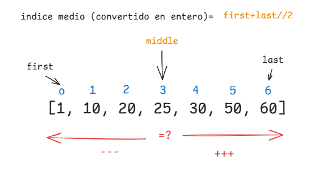

# Capítulo 1

> **Algoritmo**: es un conjunto de instrucciones para realizar una tarea específica.
>
> La idea del libro es que comprendas las **compensaciones** (evaluar las ventajas o desventajas de un algoritmo o estructura de datos) para luego utilizarlo en tus proyectos o seguir aprendiendo sobre algoritmos más específicos para IA, bases de datos, entre otros.
>
> Recomienda utilizar un lenguaje como Python por lo fácil que es de aprender.

## Busqueda binaria (Binary Search)

Supongamos que quieres buscar un número. En vez de recorrer la lista desde el inicio hasta el final (búsqueda simple/lineal), puedes utilizar la búsqueda binaria, que es mucho más eficiente cuando comienza a crecer: vas eliminando la mitad de los números restantes en cada paso.
- La lista **debe estar ordenada** para que funcione.
- Devuelve `True` si encuentra el elemento y `False` si no lo encuentra.

## Logaritmos
> Los logaritmos descubren cuál es la potencia a la que hay que elevar un número (la base) para obtener el valor buscado.
- Ejemplo: log₂(16) = 4 Es igual a decir esto 2⁴ = 16

### Tiempo logarítmico O(log n)
Nos permite descubrir cuántas operaciones necesitamos realizar para encontrar un elemento **cuando el algoritmo divide el problema a la mitad en cada paso** (como la búsqueda binaria).

- Si tenemos 16 elementos: log₂(16) = 4 → necesitamos **4 pasos como máximo** para encontrar el elemento.
- Si crece a 1,024 elementos: log₂(1024) = 10 → necesitaremos **10 pasos**.

## Notación Big O

> La notación Big O nos permite describir el tiempo de ejecución de un algoritmo en función del tamaño de la entrada (n), es decir, qué tan rápido o lento crece a medida que la entrada crece.
- Mide el **peor caso** (worst case) de un algoritmo.
- Se expresa como: O(1), O(n), O(n²), O(log n), O(n log n), etc. Me dice que tan rápido crece las operaciones.
- Medir la velocidad no se mide en segundos, si no en el crecimiento del número de operaciones.
- Medir la rápidez que tan rapido aumenta el tiempo de ejecución a medida que crece el tamaño de la entrada.

La notación Big O se escribe de la siguiente forma: O(n)

### Las complejidades más comunes (de mejor a peor)
 
| Notación | Nombre | Algoritmo típico | Con n=16 |
|---|---|---|---|
| O(1) | Constante | Acceder a un índice (`lista[5]`) | 1 paso |
| O(log n) | Logarítmico | Búsqueda binaria | log₂(16) = 4 pasos |
| O(n) | Lineal | Búsqueda simple (`for`) | 16 pasos |
| O(n log n) | Linearítmico | Quicksort, Merge sort | 16 × 4 = 64 pasos |
| O(n²) | Cuadrático | Selection sort, bucles anidados | 16² = 256 pasos |
| O(n³) | Cúbico | Tres bucles anidados | 16³ = 4,096 pasos |
| O(2ⁿ) | Exponencial | Fibonacci recursivo sin memoización | 2¹⁶ = 65,536 pasos |
| O(n!) | Factorial | Problema del viajante (fuerza bruta) | 16! ≈ 2 × 10¹³ pasos |
 
Ordenadas de mejor a peor (cada una crece más rápido que la anterior a medida que `n` aumenta):

