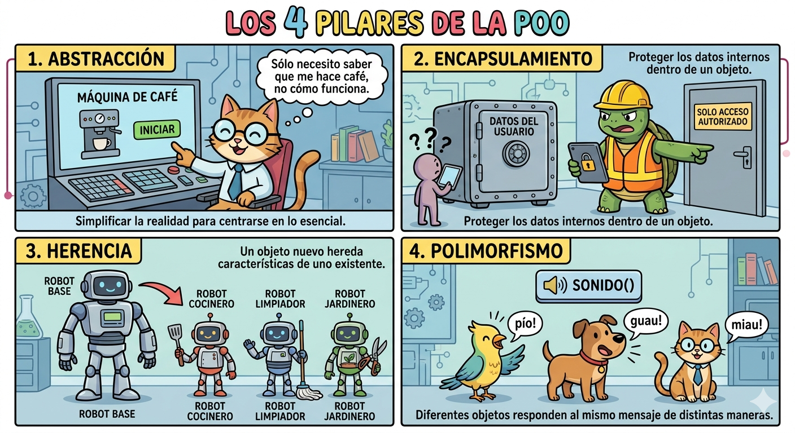

# Los 4 Pilares de la POO en Python



---

## 1. Encapsulamiento

La idea es simple: **los datos de un objeto deben estar protegidos**. Tú decides qué se puede ver desde afuera y qué no.

### Niveles de visibilidad

Python no tiene `public`, `private` ni `protected` como Java o C++. En su lugar usa convenciones con guiones bajos:

| Nivel | Sintaxis | ¿Qué significa? |
|---|---|---|
| Público | `nombre` | Cualquiera puede acceder |
| Protegido | `_nombre` | Convención: "no tocar desde fuera" |
| Privado | `__nombre` | Python aplica *name mangling* |

> **¿Qué es el name mangling?**
> Cuando escribes `__password` dentro de la clase `Usuario`, Python la renombra internamente a `_Usuario__password`. Así evita colisiones en herencia, pero **no es seguridad real**, sigues pudiendo acceder si sabes el nombre.

```python
class CuentaBancaria:
    def __init__(self, titular, saldo):
        self.titular = titular        # Público: cualquiera puede leerlo
        self._historial = []          # Protegido: solo uso interno
        self.__saldo = saldo          # Privado: acceso controlado

cuenta = CuentaBancaria("Ana", 1000)

print(cuenta.titular)               # ✅ Ana
print(cuenta._historial)            # ⚠️ Funciona, pero no deberías
print(cuenta.__saldo)               # ❌ AttributeError
print(cuenta._CuentaBancaria__saldo) # ✅ Funciona, pero es un hack
```

---

### Getters y Setters con `@property`

El encapsulamiento cobra sentido cuando controlas el acceso a los atributos privados. En Python se hace con decoradores, no con métodos `get_x()` / `set_x()`.

**¿Por qué `@property` y no métodos normales?**

```python
# Sin @property (funciona pero es poco pythónico)
cuenta.set_saldo(500)
print(cuenta.get_saldo())

# Con @property (más natural)
cuenta.saldo = 500
print(cuenta.saldo)
```

```python
class CuentaBancaria:
    def __init__(self, titular, saldo):
        self.titular = titular
        self.__saldo = saldo

    @property
    def saldo(self):
        return self.__saldo

    @saldo.setter
    def saldo(self, nuevo_saldo):
        if nuevo_saldo < 0:
            raise ValueError("El saldo no puede ser negativo")
        self.__saldo = nuevo_saldo

cuenta = CuentaBancaria("Ana", 1000)

print(cuenta.saldo)     # 1000 — usa el getter

cuenta.saldo = 500      # usa el setter (pasa la validación)
print(cuenta.saldo)     # 500

cuenta.saldo = -100     # ❌ ValueError: El saldo no puede ser negativo
```

> **Regla importante:** si defines `@property` pero no defines el `@setter`, el atributo será de **solo lectura**. Intentar asignarlo lanzará un `AttributeError`.

---

## 2. Abstracción

Abstraer significa **exponer solo lo necesario** y esconder los detalles de implementación.

El usuario de una clase no necesita saber *cómo* funciona por dentro, solo *qué* hace.

```python
class CuentaBancaria:
    def __init__(self, titular, saldo):
        self.titular = titular
        self.__saldo = saldo
        self.__historial = []

    def depositar(self, cantidad):
        self.__saldo += cantidad
        self.__registrar_movimiento("depósito", cantidad)  # detalle oculto

    def retirar(self, cantidad):
        if cantidad > self.__saldo:
            raise ValueError("Saldo insuficiente")
        self.__saldo -= cantidad
        self.__registrar_movimiento("retiro", cantidad)    # detalle oculto

    def __registrar_movimiento(self, tipo, cantidad):      # método privado
        self.__historial.append(f"{tipo}: {cantidad}")

cuenta = CuentaBancaria("Ana", 1000)
cuenta.depositar(500)   # El usuario no sabe cómo se registra el movimiento
cuenta.retirar(200)     # Solo le importa que funcione
```

Quien usa `CuentaBancaria` no sabe ni le importa cómo funciona `__registrar_movimiento`. Eso es abstracción.

> **Ojo:** abstraer no significa ocultar todo. Oculta la complejidad interna, no la información que el usuario necesita.

---

## 3. Herencia

La herencia permite que una clase **reutilice el comportamiento de otra**. La clase hija hereda atributos y métodos de la clase padre, y puede extenderlos o modificarlos.

Se utiliza `super()` voy a poder acceder a métodos y atributos desde la clase padre desde la clase hija, sin nombrar al padre. 

```python
class CuentaBancaria:
    def __init__(self, titular, saldo):
        self.titular = titular
        self._saldo = saldo

    def depositar(self, cantidad):
        self._saldo += cantidad

    def info(self):
        return f"{self.titular} — Saldo: {self._saldo}"


class CuentaAhorros(CuentaBancaria):
    def __init__(self, titular, saldo, tasa_interes):
        super().__init__(titular, saldo)       # Reutiliza el __init__ del padre
        self.tasa_interes = tasa_interes

    def aplicar_interes(self):
        self._saldo += self._saldo * self.tasa_interes


class CuentaCorriente(CuentaBancaria):
    def __init__(self, titular, saldo, limite_sobregiro):
        super().__init__(titular, saldo)
        self.limite_sobregiro = limite_sobregiro

    def retirar(self, cantidad):               # Sobreescribe el comportamiento
        if cantidad > self._saldo + self.limite_sobregiro:
            raise ValueError("Límite de sobregiro superado")
        self._saldo -= cantidad


ahorro = CuentaAhorros("Ana", 1000, 0.05)
ahorro.depositar(500)        # Heredado del padre
ahorro.aplicar_interes()     # Propio de CuentaAhorros
print(ahorro.info())         # Ana — Saldo: 1575.0

corriente = CuentaCorriente("Luis", 1000, 500)
corriente.retirar(1400)      # Funciona porque tiene sobregiro
print(corriente.info())      # Luis — Saldo: -400
```

> **Cuándo usar herencia:** solo cuando existe una relación **"es un"**.
> - `CuentaAhorros` ES UNA `CuentaBancaria` ✅
> - `CuentaBancaria` ES UN `Cliente` ❌ (aquí usarías composición)

---

## 4. Polimorfismo

Polimorfismo significa que **distintos objetos pueden responder al mismo mensaje de formas diferentes**.

Continuando el ejemplo anterior, si quisiéramos imprimir el resumen de varias cuentas:

```python
cuentas = [
    CuentaAhorros("Ana", 1000, 0.05),
    CuentaCorriente("Luis", 2000, 500),
    CuentaBancaria("Carlos", 500),
]

for cuenta in cuentas:
    print(cuenta.info())    # Mismo método, mismo mensaje para todos
```

Salida:
```
Ana — Saldo: 1000
Luis — Saldo: 2000
Carlos — Saldo: 500
```

Otro ejemplo: sobreescribiendo el método para que cada tipo de cuenta lo muestre diferente:

```python
class CuentaAhorros(CuentaBancaria):
    def info(self):
        return f"[Ahorros] {self.titular} — Saldo: {self._saldo} | Tasa: {self.tasa_interes * 100}%"

class CuentaCorriente(CuentaBancaria):
    def info(self):
        return f"[Corriente] {self.titular} — Saldo: {self._saldo} | Sobregiro: {self.limite_sobregiro}"

cuentas = [
    CuentaAhorros("Ana", 1000, 0.05),
    CuentaCorriente("Luis", 2000, 500),
]

for cuenta in cuentas:
    print(cuenta.info())
```

Salida:
```
[Ahorros] Ana — Saldo: 1000 | Tasa: 5.0%
[Corriente] Luis — Saldo: 2000 | Sobregiro: 500
```

El bucle no sabe ni le importa de qué tipo es cada cuenta. Solo llama a `info()` y cada objeto responde a su manera. Eso es polimorfismo.

---

## 5. Clases Abstractas

Una clase abstracta es una **plantilla que no se puede instanciar directamente**. Sirve para definir una interfaz común que las subclases *están obligadas* a implementar.

Se usa cuando tienes clases que comparten estructura, pero donde cada una debe implementar ciertos métodos a su manera.

Para usarlas en Python necesitas el módulo `abc`:

```python
from abc import ABC, abstractmethod
```

- **`ABC`**: hace que tu clase sea abstracta.
- **`@abstractmethod`**: marca un método que *todas las subclases deben implementar*. Si no lo hacen, Python lanzará un error al intentar instanciarlas.

### Ejemplo sin clases abstractas (el problema)

```python
class CuentaBancaria:
    def calcular_interes(self):
        pass   # ¿Qué hace esto? Nada. Nadie te obliga a sobreescribirlo.

class CuentaAhorros(CuentaBancaria):
    pass   # Se olvidaron de implementar calcular_interes... y Python no dice nada

cuenta = CuentaAhorros("Ana", 1000)
cuenta.calcular_interes()   # Ejecuta... y no hace nada. Bug silencioso.
```

### Ejemplo con clases abstractas (la solución)

```python
from abc import ABC, abstractmethod

class CuentaBancaria(ABC):        # Hereda de ABC → es abstracta
    def __init__(self, titular, saldo):
        self.titular = titular
        self._saldo = saldo

    @abstractmethod
    def calcular_interes(self):   # Obliga a las subclases a implementar esto
        pass

    @abstractmethod
    def info(self):
        pass

    def depositar(self, cantidad):          # Este método SÍ tiene implementación
        self._saldo += cantidad             # Las subclases lo heredan tal cual


class CuentaAhorros(CuentaBancaria):
    def __init__(self, titular, saldo, tasa):
        super().__init__(titular, saldo)
        self.tasa = tasa

    def calcular_interes(self):    # Obligatorio implementarlo
        return self._saldo * self.tasa

    def info(self):
        return f"[Ahorros] {self.titular} — Saldo: {self._saldo}"


class CuentaCorriente(CuentaBancaria):
    def calcular_interes(self):    # Obligatorio implementarlo
        return 0                   # Las cuentas corrientes no generan interés

    def info(self):
        return f"[Corriente] {self.titular} — Saldo: {self._saldo}"


# ✅ Esto funciona
ahorro = CuentaAhorros("Ana", 1000, 0.05)
print(ahorro.calcular_interes())   # 50.0

# ❌ Esto lanza un error
cuenta = CuentaBancaria("Ana", 1000)
# TypeError: Can't instantiate abstract class CuentaBancaria with abstract methods calcular_interes, info
```

### ¿Cuándo usar clases abstractas?

Úsalas cuando tengas un grupo de clases que deben compartir una **interfaz común**, pero donde la implementación varía por clase.

| Situación | ¿Usar clase abstracta? |
|---|---|
| Varias clases deben tener el mismo método | ✅ Sí |
| Quieres evitar que instancien la clase base | ✅ Sí |
| La clase base tiene lógica reutilizable además de la interfaz | ✅ Sí |
| Solo hay una clase y no habrá más | ❌ No |

> **Diferencia clave con herencia normal:** en herencia normal puedes olvidarte de sobreescribir un método y Python no dirá nada. Con `@abstractmethod`, Python te fuerza a implementarlo. Es un contrato.

---

## Resumen

| Pilar | ¿Qué resuelve? | Mecanismo en Python |
|---|---|---|
| **Encapsulamiento** | Protege el estado interno del objeto | `__atributo`, `@property` |
| **Abstracción** | Oculta la complejidad interna | Métodos públicos que ocultan lógica privada |
| **Herencia** | Reutiliza comportamiento entre clases relacionadas | `class Hija(Padre)`, `super()` |
| **Polimorfismo** | Mismo método, comportamiento diferente por clase | Sobreescribir métodos en subclases |
| **Clases abstractas** | Define contratos que las subclases deben cumplir | `ABC`, `@abstractmethod` |