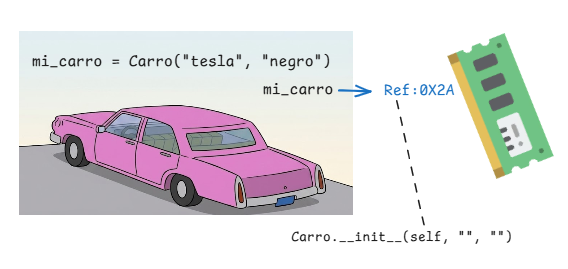
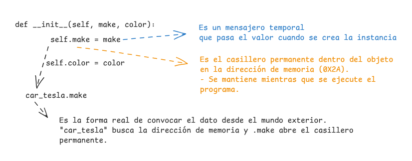

# Programación Orientada a Objetos (POO) en Python

> La POO es un **paradigma de programación** que organiza el código estructurando las funciones y los datos en entidades llamadas **objetos**. Nos permite modelar problemas del mundo real mediante código limpio, ordenado y reutilizable.

Entonces POO no va a ayudar a organizar el código.

## Como se crea una clase

Básicamente, la clase es el molde para crear diversos objetos únicos. A este proceso de creación se le llama instanciación, y el objeto resultante es una instancia de esa clase. Como se puede observar en el ejemplo de los gatos.


La clase se compone de:
- Características que vienen a ser los atributos.
- El comportamiento es el métodos


```python
# 1. Nombre de la clase en PascalCase
class Carro:
    # 2. Docstring (Documentación)
    """Representa un vehículo.""" 

    # 3. Atributo de clase (Compartido por todos)
    ruedas = 4

    # 4. Constructor (Se ejecuta automáticamente) y va a pedir que se le ingrese los párametros
    def __init__(self, marca, color):
        # 5. Atributo de instancia (Único de este objeto)
        self.marca = marca
        self.color = color

    # 6. Método (Funcionalidad / Comportamiento)
    def arrancar(self):
        print(f"🚗 {self.marca} de color {self.color} arrancó.")

# Pasamos los datos al constructir, python ejecuta __init__ en segundo plano y nos devuelve una INSTANCIA única. y cuando esta afuera se le llama argumentos
mi_carro = Carro("tesla", "negro")
```

Lo que va a pasar al momento de crear la variable de ``mi_carro`` esto se almacena en memoria y almacena la referencia y python automaticamente llama al metodo Carro.``__init__``(mi_carro, "tesla", "negro") para eso es el self que almacena la referencia.



### Atributos: Instancia vs. Clase

* **Atributo de Instancia (`self.atributo`):** Se define dentro del `__init__`. Cada objeto tiene su propio valor independiente (ej. la marca o el color del carro).
  - Se utiliza cuando quiero datos del objeto.
* **Atributo de Clase:** Se define directamente bajo la clase. Todos los objetos comparten exactamente el mismo valor (ej. todos los carros tienen 4 ruedas).
  - Cuando quiero datos globales de la clase.




### Métodos
En Python, todos los métodos de una instancia deben recibir `self` como su primer parámetro.

- Si quieres que el método imprima el nombre del coche, necesita self para ir a buscar ese dato permanente en la memoria RAM que vimos antes.

```python
def arrancar(self):
    # Usa 'self' para entrar a la memoria y sacar la marca de ESTE coche
    print(f"🚗 El {self.make} arrancó.")
```
---

## 🚀 ¿Por qué usar POO?

* **Organización:** Agrupa datos (atributos) y funcionalidades (métodos) en una sola unidad lógica.
* **Reutilización:** Escribe una plantilla (clase) una vez y crea infinitos objetos a partir de ella.
* **Escalabilidad:** Permite extender y modificar software existente sin romper el código actual.
* **Comunicación:** En una aplicación real, los objetos son independientes pero **se comunican entre ellos** para realizar tareas complejas (por ejemplo: un objeto *Usuario* interactúa con un objeto *Curso* y genera un objeto *Factura*).

---

## 🏛️ Los 4 Pilares de la POO

El paradigma de la programación orientada a objetos se sostiene sobre cuatro pilares fundamentales que definen la simplicidad y la funcionalidad del código:

| Pilar | ¿Qué es? | ¿Para qué sirve? |
| :--- | :--- | :--- |
| **1. Abstracción** | El proceso de **definir los atributos y los métodos** esenciales de una clase, ignorando los detalles complejos no relevantes. | Diseñar el molde inicial del objeto de manera clara. |
| **2. Encapsulamiento** | Mecanismo que **protege la información** y el estado interno de un objeto contra manipulaciones o accesos no autorizados. | Mantener la integridad de los datos exponiendo solo lo necesario. |
| **3. Herencia** | Capacidad que permite a las **clases hijo heredar atributos y métodos** de una clase padre. | Reutilizar código y crear jerarquías especializadas sin duplicar lógica. |
| **4. Polimorfismo** | Propiedad de dar la **misma orden a varios objetos** diferentes para que respondan de maneras distintas. | Permitir que diferentes clases tengan métodos con el mismo nombre pero comportamientos específicos. |

---

## 🏎️ Ejemplo Práctico

A continuación se muestra cómo aplicar la **clase base (padre)**, la **herencia** hacia una **clase hija**, y la creación de **instancias (objetos)**:

```python
# Clase Padre
class Vehiculo:
    """Clase base para cualquier tipo de vehículo."""
    
    def __init__(self, marca, velocidad_max):
        self.marca = marca
        self.velocidad_max = velocidad_max
        self.encendido = False

    def arrancar(self):
        self.encendido = True
        print(f"⚡ El {self.marca} ha sido encendido.")

# Clase Hija (Hereda de Vehiculo)
class AutoElectrico(Vehiculo):
    """Clase especializada en autos eléctricos."""
    
    def __init__(self, marca, velocidad_max, autonomia_bateria):
        # super() conecta y transfiere los atributos del Padre
        super().__init__(marca, velocidad_max)
        self.autonomia = autonomia_bateria  # Atributo propio de la clase hija

    def cargar_bateria(self):
        print(f"🔋 Cargando la batería del {self.marca}. Autonomía actual: {self.autonomia}km.")

# --- Instanciación y uso de Objetos ---

# Creamos un objeto de la clase hija
mi_tesla = AutoElectrico("Tesla Model 3", 225, 500)

mi_tesla.arrancar()        # Método HEREDADO del padre
mi_tesla.cargar_bateria()  # Método PROPIO del hijo

```

---

## 📋 Resumen del Glosario POO

| Término | ¿Qué representa en el mundo real? | ¿Qué es en código Python? |
| --- | --- | --- |
| **Clase** | El plano o molde de diseño de un producto. | `class NombreClase:` |
| **Objeto** | El producto final fabricado con el molde. | `mi_objeto = NombreClase()` |
| **Atributo** | Las características o datos de la entidad (color, nombre, precio). | `self.variable = valor` |
| **Método** | Las acciones o funciones que la entidad puede realizar (correr, editar). | `def nombre_metodo(self):` |
| **Docstring** | El manual de usuario o instrucciones del producto. | `""" Texto explicativo """` |